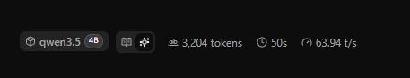

# LLM Chat Server for cheapest gpu Nvidia

llama-cpp-server และ Qwen3.5 4B โมเดลสำหรับรันบน GPU ของ NVIDIA

<div align="center">
  
</div>

<div align="center">
  
  <h1>Speed up to 60T/S</h1>
</div>

## Stack

- รองรับ GPU ของ NVIDIA ผ่าน CUDA 12.4
- โมเดล Qwen3.5 4B (4-bit quantized)
- ใช้ Docker รันบน GPU

## Models Download

ดาวน์โหลดโมเดลจาก Hugging Face:
```
https://huggingface.co/unsloth/Qwen3.5-4B-GGUF
```

ดาวน์โหลดไฟล์ `.gguf` มาแล้วนำไปไว้ที่ `models/` โฟลเดอร์

## ติดตั้งและรัน

### Requirement

- Docker Desktop (มี NVIDIA Container Toolkit)
- การ์ดจอ NVIDIA 6GB+

### ขั้นตอน

```bash
# สร้างและรัน container
docker compose up -d

# ดู log
docker compose logs -f qwen-server

# ปิด service
docker compose down
```

## เข้าใช้งาน

เปิด `http://localhost:8080` ใน browser

## ตั้งค่าเพิ่มเติม

แก้ไข `docker-compose.yml` เพื่อปรับ:

- `--model`: path ของโมเดล
- `--n-gpu-layers`: จำนวน layer ที่ใช้ GPU (เพิ่ม = เร็วขึ้น)
- `--port`: พอร์ตที่เข้าถึง

## โครงสร้างไฟล์

```
llama/
├── README.md
├── Dockerfile          # Build config
├── docker-compose.yml  # รันบน GPU
└── models/             # ที่เก็บโมเดล
    └── Qwen3.5-4B-Q4_K_M.gguf
```
